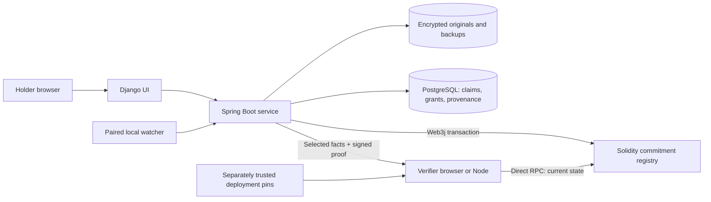

# Foliolet

**Share the fact, not the file.**

A recruiter needs to know whether your CGPA clears a threshold. Sending a
marksheet also gives them your exact grades, date of birth and other details
that have nothing to do with the decision.

Foliolet keeps the original in an encrypted custodial vault. You review the
facts, commit them, and share a proof containing only the facts you select.
A verifier can check that proof against the current on-chain credential state
without receiving the original document.

For example, share **“CGPA at least 8.5 = true”** while the exact **9.17**, name,
birth date and institution remain absent from the selective bundle. The boolean
is computed by the platform from a holder-confirmed number. It is a committed
statement, not a zero-knowledge inequality proof or proof of issuer truth.

[Run guide](docs/RUN_GUIDE.md) · [Architecture](docs/ARCHITECTURE.md) ·
[Proof format](docs/PROTOCOL.md) · [Security](docs/SECURITY.md) ·
[Validation](docs/VALIDATION.md) ·
[HackSprint presentation](submission/Foliolet-HackSprint-PS32.pptx)

## How it works

1. **Enroll.** Upload an ordinary document. Supported text/PDF/CSV extraction
   supplies suggestions; other formats can use manual facts. The original and
   its backup are encrypted. No external AI call is needed.
2. **Review.** Confirm typed facts against the document. Canonical paths, values,
   labels and derivation metadata become part of the commitment. Custom claims
   are visibly holder-authored; recognized derived thresholds are distinct.
3. **Commit.** Each claim gets a random 32-byte salt. Domain-separated Keccak-256
   hashes form a Merkle tree. Web3j submits a real Solidity transaction anchoring
   the root, salted document commitment, provenance digest and credential state.
4. **Disclose.** Choose claim IDs, intended-verifier label, purpose, expiry and
   optional one-time release. The service creates their inclusion proofs and
   signs the presentation context. A random bearer link releases the bundle.
5. **Verify.** The browser recomputes membership and the platform signature,
   then reads the registry through a chosen RPC. A downloadable JSON bundle can
   be checked by the separate Node verifier without Spring or holder credentials.

A genuine selective bundle contains the selected leaves and their salts,
Merkle siblings, signed context and anchor metadata. It omits hidden values,
hidden salts and original bytes. The format is documented in
[PROTOCOL.md](docs/PROTOCOL.md); JSON itself is not the hashing representation.

## Where the data lives



The blockchain is the independently readable commitment and credential-state
layer. Private documents and fact values stay off-chain. PostgreSQL holds
ownership and release policy; sensitive leaf records and stored presentations
are encrypted. The browser displays service verification separately from its
independent cryptographic check.

The stack is Java 17 / Spring Boot, Django, PostgreSQL, Solidity 0.8.19, Web3j,
and browser/Node JavaScript with ethers. The demonstrated deployment uses a
persistent local Ganache EVM, not a public network.

| Location | Responsibility |
|---|---|
| `django-service/` | Holder UI, review, sharing and public verification |
| `spring-boot-service/…/selective/` | Vault, canonical facts, Merkle trees, grants and provenance |
| `spring-boot-service/contracts/` | Immutable commitments, versions and credential state |
| `spring-boot-service/scripts/verify-proof.cjs` | Separate Node verifier |
| `tools/local-watcher/` | Authenticated, sampled first-seen observations |
| `tools/` | Local startup and live validation |
| `docs/` | Protocol, trust model, runbook and measured results |

## Run locally

The tested path is Windows PowerShell with Java 17+, Python 3.12+, Node/npm and
PostgreSQL. Maven is included through its wrapper. Use harmless documents for
this local development setup. The [complete guide](docs/RUN_GUIDE.md) includes
the Docker alternative, configuration, watcher pairing and shutdown.

```powershell
git clone https://github.com/legoambarish/Foliolet.git
cd Foliolet
python -m venv .venv
.\.venv\Scripts\python.exe -m pip install -r django-service/requirements.txt -r tools/requirements-dev.txt
npm ci
npm --prefix spring-boot-service ci

# Isolated portable PostgreSQL; skip if using the documented Docker route.
.\tools\setup-local-postgres.ps1
.\tools\start-postgres.ps1
```

Start these in three terminals, from the repository root:

```powershell
npm run evm                       # terminal 1: persistent EVM, port 8545
.\tools\start-backend.ps1          # terminal 2: Spring, port 8080
.\tools\start-frontend.ps1         # terminal 3: Django, port 8000
```

The EVM launcher creates an ignored local signing key on first use. Backend
startup reads it unless `BLOCKCHAIN_PRIVATE_KEY` is supplied. Preserve that key,
chain state, registry records and vault keys across restarts. An existing chain
without its relay key fails closed rather than silently changing identity.

**Provision independent trust before the demo.** Create
`.local-data/trusted-deployment.json` with a separately reviewed deployment identity:

```json
{
  "contract": "0xYOUR_TRUSTED_REGISTRY_ADDRESS",
  "operator": "0xYOUR_TRUSTED_OPERATOR_ADDRESS",
  "chainId": 1337
}
```

Replace both placeholders with nonzero 20-byte addresses from your deployment
record and check them against a trusted RPC. The retained registry record is
under `.local-data/chain`; the EVM launcher prints its operator address. Do not
copy supposedly trusted pins from Spring's discovery endpoint or a bundle.
Django reads this file at startup; `WALLET_TRUST_FILE` can select another path.
Missing, malformed or mismatched pins prevent independent acceptance.

Open **http://localhost:8000**, create a holder account and sign in. All runtime
keys, credentials, databases and vault data belong under ignored local storage.
No accounts or private signing keys are shipped in the repository.

## Try the marksheet demo

1. Enroll [demo-marksheet.txt](docs/demo-marksheet.txt) as an Education document.
2. Review its five suggested facts. Confirm them; Foliolet adds the sixth fact,
   **CGPA at least 8.5 = true**.
3. Anchor the commitment. Inspect its transaction, root and registry address.
4. Select only the threshold, enter a purpose and expiry, and create a link.
5. Open the link as a verifier. Press **Open disclosed facts**, then
   **Check proof and chain**. The service and independent results are separate.
6. Download the bundle and check it from another process:

```powershell
node spring-boot-service/scripts/verify-proof.cjs disclosure-proof.json `
  --rpc http://127.0.0.1:8545 `
  --contract YOUR_TRUSTED_REGISTRY `
  --operator YOUR_TRUSTED_OPERATOR `
  --chain-id 1337
```

All three identity pins are required. Changing a fact invalidates the proof.
Revoking the credential invalidates its current on-chain state. Expiry, share
revocation and one-time release control service access; they cannot erase a
bundle someone already downloaded or prevent copying.

The optional paired watcher records signed, ordered observations before
upload. Matching enrollment bytes can receive a **first-seen tracked** label.
This is sampled continuity from a holder-controlled agent, not issuer
attestation, original creation time or a complete history of every change.

## Validation

Validated on the local HTTP/PostgreSQL/Web3j/Ganache stack:

| Suite | Passing evidence |
|---|---|
| Backend | 14 tests |
| Django | 19 tests; system check clean |
| Browser/Node regressions | 22 tests |
| Contracts | Authorization/state transitions and 7 Merkle tree shapes |
| Live integration | 51 checks |
| Live security | 23 checks |

The live checks include independent browser/Node verification, tampered-proof
rejection, hidden-value/salt omission, expiry, revocation, concurrent one-time
release, username uniqueness and the full marksheet flow. See
[VALIDATION.md](docs/VALIDATION.md) for reproduction details and limits.

```powershell
Push-Location spring-boot-service
.\mvnw.cmd -B package
Pop-Location
npm run test:contracts
npm run test:verifier
Push-Location django-service
..\.venv\Scripts\python.exe manage.py test --noinput
..\.venv\Scripts\python.exe manage.py check
Pop-Location

# Requires all local services and trusted pins; creates disposable test records.
.\.venv\Scripts\python.exe tools/test-live-workflow.py
.\.venv\Scripts\python.exe tools/test-live-security.py
```

## What a proof does—and does not—establish

This is a **custodial commitment-verification system**. With separately trusted
deployment pins, independent verification checks disclosed facts' cryptographic
membership, platform-signed context and current on-chain credential state.

It does **not** independently establish holder authorization if the custodial
platform is malicious. The platform can decrypt records and sign presentations;
disclosure authorization and policy remain enforced by that service. A valid
proof also does not establish issuer authenticity or faithful extraction from
document bytes. First-seen tracking adds limited continuity/provenance only.

Encryption covers stored originals/backups, sensitive claim records and stored
presentations. It does not hide data from the custodial service, encrypt every
metadata field or make the development host a hardened vault. Bearer links are
transferable; verifier labels do not authenticate recipients. Repeated proofs
can be correlated through their commitment metadata.

Local key protection, Basic-auth sessions, recovery/snapshot races, rate limits,
production HTTP controls, dependency advisories, RPC trust and local-chain
reset authority remain documented limitations. Read [SECURITY.md](docs/SECURITY.md)
before considering a nonlocal deployment. No production certification, full
decentralization, copy prevention or arbitrary ZK capability is claimed.

## Direction and provenance

Useful next steps are issuer-attested enrollment, holder-controlled disclosure
signatures, VC interoperability and production key/HTTP/operational hardening.
These are future work, not features of this submission.

Foliolet is the HackSprint PS32 implementation built on the
[Evidentia foundation](https://github.com/suryaanshs007/Evidentia). Git history and
internal Java/Django identities are retained. The new default experience is
universal document/proof sharing; the inherited legal UI is opt-in under
`/legacy/`. Optional legacy AI analysis is outside the wallet proof flow.

Merkle proofs, selective disclosure and commitment schemes are established
techniques. The contribution here is their working ordinary-document workflow
and explicit trust model. Third-party browser assets retain their licenses in
`django-service/dashboard/static/wallet/vendor/`; this repository does not
assert a new blanket license over inherited code.
