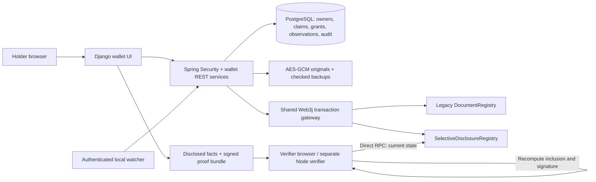

# Foliolet architecture

Foliolet is the public product identity; `PRODUCT_LABEL` can override its display label. The inherited Java package, Django project name and legacy registry remain internal compatibility identities.

## Enrollment and anchoring

The holder uploads any ordinary document (20 MB limit) into a private wallet. Text/PDF/CSV extraction supplies editable suggestions; other formats support manual facts. There is no external AI call in this workflow. Unconfirmed draft suggestions are regenerated from the encrypted original on demand and sent only through the authenticated owner flow. Django does not retain suggestions in signed session data. A migration removes retained pre-fix copies, including expired sessions; middleware removes legacy copies on access. Confirmation stops returning suggestions. This preserves the existing vault, without adding a second draft store.

The holder confirms typed, canonical facts before anchoring. `education.cgpa` also produces a platform-computed `education.cgpa_at_least_8_5` boolean. Persisted originals/backups, claim values with per-leaf salts, and signed disclosure bundles are encrypted. This is a custodial encrypted development vault; application memory, displayed/transmitted values, some database metadata and reusable Basic credentials in Django sessions are not covered by that encryption claim.

Each version has an unpredictable bytes32 credential ID. PostgreSQL records ownership and a logical version chain. A separate Solidity registry stores only the fact root, salted document commitment, provenance digest, platform operator, anchor timestamp, version and status. An initial anchor or replacement is a real signed Web3j transaction; a replacement supersedes the prior version atomically in Solidity. Existing `DocumentRegistry` and legacy APIs remain operational.

SQL cannot roll back an EVM transaction. The service persists `ANCHOR_PENDING` and freezes facts before broadcasting. Retry recovers the same anchor by checking all immutable fields. A successful chain read finishes the SQL transition to `ACTIVE`. If a transaction mined before a process failed, its receipt hash may be unavailable on recovery, but the root and chain record remain independently readable. Revocation also allows safe retry. Concurrent replacements resolve through the contract's active-previous-version check; a losing pending draft needs operator handling rather than silently acquiring a different root.

## Holder-to-verifier flow

An owner chooses claim IDs, purpose, intended-verifier label, expiry (1 minute to 7 days) and optional one-time release. The backend rechecks current on-chain state and private-file integrity. It creates inclusion proofs only for those claims, signs the complete presentation context using the platform relay key, encrypts the bundle, and stores only SHA-256 of a random 256-bit bearer token. The raw link is displayed once, with a locally generated QR code.

GET renders a landing page without releasing facts. Explicit CSRF-protected POST opens the presentation. The backend checks Merkle inclusion, envelope signature, trusted deployment identity, active chain state and expiry before releasing. A PostgreSQL row lock makes one-time release atomic; receipts and holder audit events record the release. A receipt records successful service release, not proof that an identified human accepted the facts.

For genuine selected bundles, the verifier sees selected facts, assurance and purpose; no original, hidden fact value, or hidden leaf salt is present. A malicious custodial platform can disclose other values it possesses. Independent verification checks cryptographic membership and pinned on-chain credential state; it does not independently establish holder authorization against a malicious platform. Disclosure authorization and policy remain custodial.

Django requires a structurally valid bundle and explicit success for every service verification flag before rendering, caching or exporting. The service result and independent result are visually separate. Every disclosed fact displays canonical path/type/derivation. An exact recognized threshold tuple is labeled platform-derived; other statements display an explicit holder-authored classification and custom-label prefix. The shared composer preview preserves the distinction.

Local JavaScript validates the v1 schema and canonical values, independently recomputes leaves, paths, provenance digest and EIP-191 envelope signature, then reads the registry directly from a chosen RPC. Registry/operator/chain pins are mandatory and come from separately provisioned Django-side `WALLET_TRUST_FILE`, never Spring's discovery endpoint or the bundle. The independent Node tool requires all three explicit pins and performs the same cryptographic/chain checks without Spring or holder credentials. The verifier code, pin provisioning and RPC remain trusted dependencies. Server-reported link status is separate and cannot prove holder consent.

Proof export uses a normal session-bound HTTP attachment of an already released bundle, encrypted in a bounded five-presentation cache under the Django secret. It validates response structure, canonical claim/path/derivation values and current service verification without reopening or consuming a one-time grant. False/malformed rechecks remove the cache entry and return no bundle. Java public verification parses v1 JSON strictly; extra unsigned fields and scalar coercions are rejected. All verifier layers require provenance text to agree with its numeric assurance code.

## Provenance and continuity

`SELF_ENROLLED` means holder-confirmed facts associated with the anchored file commitment. `FIRST_SEEN_TRACKED` means enrollment bytes matched the observations read for a file from a holder-paired agent. It is a frozen, limited continuity/provenance signal, not independent issuer authenticity. There is no atomic enrollment/ingress cutoff guarantee. Server receipt time, rather than a claimed local creation timestamp, defines first-seen time. A changed history or mismatch downgrades assurance. No `ISSUER_VERIFIED` credential can currently be registered; Solidity rejects unsupported assurance codes.

Pairing creates a scoped per-owner HMAC secret, shown once and encrypted in PostgreSQL. The watcher recursively samples stable bytes; UUID file identity plus signed monotonic sequence and previous digest avoid cross-account filename collisions and replay changes. A durable local outbox retries identical records. Startup scans preserve identity through restarts. A rename is currently a new path/file identity; deleted files, offline changes and changes between samples are not comprehensively captured. A holder controls the agent and can fabricate reports, so it is not independent attestation.

After enrollment, AES-GCM and the salted file commitment detect storage alteration. Recovery installs a backup only after decrypting it and comparing its bytes against the anchored commitment. Legacy recovery was also narrowed to require an anchor match before copying.

## Data and modules

| Layer | Main implementation |
|---|---|
| Typed facts / Merkle tree | `ClaimCanonicalizer`, `MerkleTreeService` |
| Private storage / serialization | `PrivateVault`, `WalletJson` |
| Version lifecycle / integrity | `WalletService`, `CredentialDocument`, `CredentialClaim` |
| Presentations / release policy | `PresentationSigner`, `DisclosureService`, `DisclosureGrant`, `DisclosureReceipt` |
| Pre-upload continuity | `IntegrityService`, `IntegrityAgent`, `FirstSeenObservation`, `tools/local-watcher/watch.py` |
| REST / access control | `WalletController`, `PublicVerificationController`, existing Spring Security / users |
| EVM | `EvmGateway`, `SelectiveDisclosureBlockchainService`, `SelectiveDisclosureRegistry.sol` |
| UI / independent verifier | `wallet_views.py`, wallet templates/static assets, `proof-core.js`, `verify-proof.cjs` |
| Audit | Existing `AuditService` / `AuditLog`, extended with credential and disclosure references |

Wallet owner checks apply even to legacy ADMIN accounts. Existing document/case endpoints retain their prior RBAC; the legal UI is disabled by default and available only at `/legacy/` with explicit `ENABLE_LEGACY_UI=true`. Old data is not migrated or relabeled as new assurance. Legacy candidate reports now require authentication and are scoped to account; old reports with no owner are not new wallet provenance.

## Deliberate adaptations of the plan and paper

1. Separate registry and wallet tables preserve working legacy behavior while supporting an immutable version lifecycle.
2. Custodial enrollment reuses existing authentication and server storage. The presentation signature belongs to the platform relay, not a holder Ethereum wallet or an external issuer.
3. Original-byte commitments are additionally salted, avoiding public deterministic document-fingerprint lookup.
4. Random per-leaf salts, Keccak-256 and explicit binary domains align with the existing EVM stack. This is not a wire-compatible implementation of the paper's MECQV credential system.
5. No ECQV certificates, DID issuance, hidden-path ZK proof, private range circuit, issuer identity registry, IPFS publication or mandatory AI extraction were added. The precomputed threshold is clearly labeled as a committed platform-derived claim.
6. Audit receipts and share revocation stay in PostgreSQL; chain responsibilities are immutable commitment, provenance digest and credential state. No false claim of blockchain-immutable application audit is made.

Selective disclosure, Merkle inclusion, verifiable credentials and ZK proofs are established prior art. The hackathon contribution is the integrated ordinary-document workflow: private enrollment, explicit assurance, pre-upload continuity, controlled disclosure, current-state verification and usable holder/verifier interfaces. See the supplied HackSprint PS32 plan and Wang and Zhang, *An Efficient Distributed Identity Selective Disclosure Algorithm*, Applied Sciences 15, 8834 (2025), DOI `10.3390/app15168834`; their benchmark figures are not measurements of this implementation.
